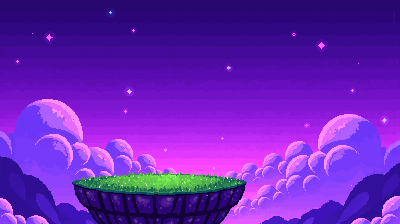
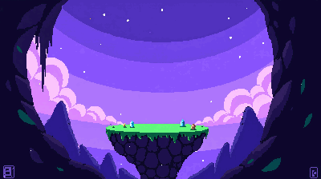
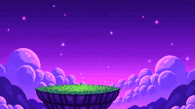

# Cozy Chaos — Product, Art, and Delivery Roadmap

Last updated: 2026-08-02 (Session 17). This is the shared handoff for BK,
Claude, and Codex.

> **Source of truth:** the active combat contract is
> `DESIGN-RUNE-BODY-COMBAT.md`. If this roadmap conflicts with that document,
> this roadmap is wrong.

## 1. Product intent

Cozy Chaos is a light, funny, addictive online physics duel inspired by Cat vs
Dog and Gunbound, but themed around magic. The player is allowed to draw a
name, a messy scribble, or an unfamiliar shape: every non-empty stroke becomes
literal physical matter.

The active product rules are:

- Both players draw secretly and cast simultaneously under identical rules.
- There are no assigned combat roles and no mode toggle.
- Ink buys mass. Fixed launch energy converts that mass into speed:
  - little Ink → light, fast, long reach → a strike;
  - much Ink → heavy, slow, short reach → a wall near the caster.
- Cast is a short direction-only drag. Drag length and pointer speed never buy
  power.
- Opposing rune matter destroys opposing matter symmetrically. The heavier
  body loses proportionally less, so defence emerges from physics rather than
  a separate shield resource.
- A spell consists of particles and bonds. Broken fragments stay physical and
  may remain dangerous while they retain energy.
- Wind and seeded, immutable crystals create Mini-Gunbound-style trajectory
  decisions. Collision is determined by authoritative geometry, never pixels.
- Fresh matter cannot hit its caster; matter deflected by a crystal, bond, or
  opposing rune can.

Punchline: **Draw Magic. Expect Chaos.** Mastery comes from Ink commitment,
aim, wind, collisions, fragments, and reflectors—not from reproducing four
approved symbols.

The previous assigned-role and reserved-Ink shield design was removed in
Session 12. It is historical context only and must not be reintroduced from an
old document.

## 2. Camera and art direction

The runtime remains a **side-view Canvas 2D simulation**. The active visual
pilot is now cohesive pixel art rather than the earlier hand-painted cave kit:

- floating dream island against a magical dream sky;
- layered/parallax background with crisp pixel clusters and a limited
  indigo-violet palette;
- faceted crystals, readable silhouettes, and side-view PixelLab wizards;
- procedural rune particles kept crisp above painted scenery.

This keeps arcs, wind, bounces, and spell-to-spell collisions readable. A true
3D/isometric runtime is outside the MVP contract: a screen-space stroke would
need an extra depth-plane interpretation, and hidden depth weakens the fairness
of Gunbound-like ballistics. See amendment A-07 in `PRD-AMENDMENTS.md`.

3D is still valid as an **asset pipeline**: build or generate a consistent 3D
character, then render it into 2D sprite sheets. Only PNG output enters the
runtime.

BK selected PixelLab as the active 2D asset direction in Session 16 and
explicitly skipped the playtest-first art gate. Session 17 extends that choice
to an environment concept. Runtime geometry remains procedural and
server-aligned; generated pixels are presentation/reference only.

## 3. Current implementation snapshot

Implemented vertical slice:

- TypeScript monorepo with shared config, protocol, and deterministic sim.
- Authoritative WebSocket room server, room codes, reconnect, and rematch.
- Fixed-timestep, seeded Resolve; both clients receive identical frames.
- `Setup → Draw → Cast → Reveal → Resolve → Score` flow.
- Arbitrary-stroke rune bodies made from particles and breakable bonds.
- Ink→mass→speed→reach combat with symmetric, mass-weighted destruction.
- Seeded Round wind and randomized immutable crystal reflectors.
- Circle/capsule-vs-triangle collision with swept anti-tunnelling.
- Responsive multiplayer browser UI; portrait 390×844 was verified without
  overflow in Session 11.

Verification on 2026-08-02: **191 tests passed**. Typecheck, build, and audit 0
also passed again in Session 17.

Relevant contracts:

- `DESIGN-RUNE-BODY-COMBAT.md`
- `PRD-AMENDMENTS.md`
- `PRD.md`
- `HANDOVER-CODEX.md`
- `ASSET-PROVENANCE.md`
- `changelog.md`

## 4. Generated ImageGen asset inventory

All generated files are intentionally retained for provenance. None is wired
to `matchScene.ts`; the programmatic renderer remains active.

### Historical arena concept — 1672×941

This file belongs to the removed pre-Session-12 environment direction. It is
kept as history and must not be used as the active background. It is no longer
shown as the main arena preview because doing so made the obsolete cave look
like the current art direction.

Historical file: `client/public/assets/generated/cozy-cave-arena.png`

### Cyan wizard candidate — 1254×1254, transparent

File: `client/public/assets/generated/wizard-cyan.png`

### Pink wizard candidate — 1254×1254, transparent

File: `client/public/assets/generated/wizard-pink.png`

### Obsolete-theme reflector sheet — 1672×941, transparent

This sheet also belongs to the removed environment direction and is retained
only for provenance. It is not previewed as current art.

Historical file: `client/public/assets/generated/cave-reflectors-sheet.png`

The two wizard cutouts remain candidates, but their 48–80 px readability must
be tested before integration. Exact status, prompts, and processing are in
`ASSET-PROVENANCE.md`; machine-readable metadata is in
`client/public/assets/generated/manifest.json`.

## 5. PixelLab runtime pilot

BK explicitly overrode the playtest-first gate in Session 16 and selected
PixelLab as the current 2D art route. Codex used the official PixelLab API
directly and generated:

- one cyan 8-direction source character, with only `east` consumed at runtime;
- six-frame neutral idle;
- eight-frame role-neutral cast;
- a deterministic local cyan→pink palette derivative, so the second team
  cannot drift in pose or silhouette;
- four packed runtime sheets plus a machine-readable manifest.

### Current environment concept — 400×224

Session 17 replaces the prominently displayed cave concept with an open dream
sky and floating island in the same pixel-art direction as the runtime wizard.
It is an art-direction reference, not collision geometry: the authoritative
platform, crystals, and their randomized positions still come from shared
config and server snapshots.

File: `client/public/assets/pixellab-pilot/environment/dream-island-arena.png`

The generation trail is deliberately retained. V1 was rejected because it
reintroduced a cave-like dark aperture and made the play surface too small.
V3 was rejected because the image-to-image edit did not materially widen the
platform. V2 is the accepted direction because the sky is open edge-to-edge
and the combat area remains visually quiet.

| Variant | Preview | Decision |
|---|---|---|
| Rejected V1 |  | Cave-like edge frame; platform too small. |
| Accepted V2 |  | Open sky; current environment reference. |
| Rejected V3 |  | Edit did not materially change V2. |

The first cast attempt was rejected because PixelLab baked cyan magic arcs into
the middle frame. A single targeted revision removed all visual spell effects;
the clean v2 is the only cast consumed by the renderer. The rejected frames are
retained and labelled so Claude can see why they must not ship.

Character generation spent 14 trial generations and the environment pass spent
3 more; 23 of 40 remained after Session 17. The API token is not stored in
source, docs, manifest, environment, or git. Because it was pasted into chat,
rotate it after this session.

Runtime integration is intentionally one-way: PixelLab draws the wizard, while
server snapshots still own position, Wobble, collision, and score. Canvas
nearest-neighbour rendering uses a stable `(92, 131)` pivot. If a sprite sheet
has not decoded, the existing procedural wizard draws instead.

Files and exact QA notes live in `ASSET-PROVENANCE.md` and
`client/public/assets/pixellab-pilot/manifest.json`.

## 6. Delivery roadmap

### Stage 1 — Repository recovery and source-truth sync — complete

- Align roadmap, README, provenance, and manifest with the active combat code.
- Amend the obsolete Three.js requirement to layered Canvas 2D.
- Preserve and commit Sessions 8–15 in readable groups: shared sim/protocol,
  server, client, art candidates, then documentation.
- Gate: 191 tests, typecheck, build, audit 0, and a clean worktree.

### Stage 2 — Human combat validation — deferred by BK

This gate was intentionally skipped in Session 16 to advance the PixelLab
direction. The debt is deferred, not deleted. Before meta balancing, public
beta, or cosmetic production batches:

- export per-Turn telemetry from authoritative server snapshots;
- run 10+ human playtests;
- measure whether players discover “little Ink = strike, much Ink = wall”;
- measure intentional heavy-rune interception, deflection readability, Turns
  per KO, match duration, and “my drawing was not read” complaints;
- define a pass threshold and a design response for every metric.

The full original execution contract remains T6–T7 in `HANDOVER-CODEX.md`.

### Stage 3 — PixelLab characters — active

- **3A complete:** cyan base, idle, clean cast, pink palette derivative,
  sprite-sheet loader, procedural fallback.
- **3A environment complete:** replace the obsolete cave preview with a
  PixelLab open-sky dream-island reference; keep runtime collision geometry
  procedural.
- **3B next:** add hit and KO only after the integrated pilot is accepted at
  real 48 px and 80 px render sizes.
- **3C later:** produce a separately generated pink character only if the
  deterministic palette derivative proves too similar; do not spend credits
  merely to duplicate motion.

Do not generate spell projectiles as sprite assets. The player's literal rune
matter and its fragments remain procedural and physics-owned.

### Deferred beyond the MVP

- true 3D/isometric runtime physics;
- eight-direction character rotations;
- fixed spell sprites that replace literal player-drawn matter;
- cosmetic production batches before combat passes human validation.

## 7. Decision ownership

Claude remains main lead. `HANDOVER-CODEX.md` determines the immediate task
order; this roadmap records product direction. BK owns the Stage 3 art-style
decision. Claude or Codex may implement the chosen work, but neither should
silently change combat physics while performing an art task.
