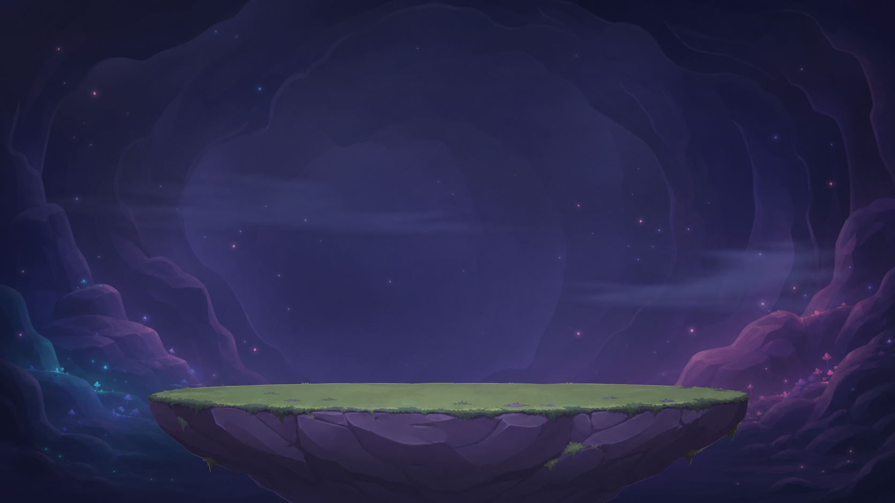
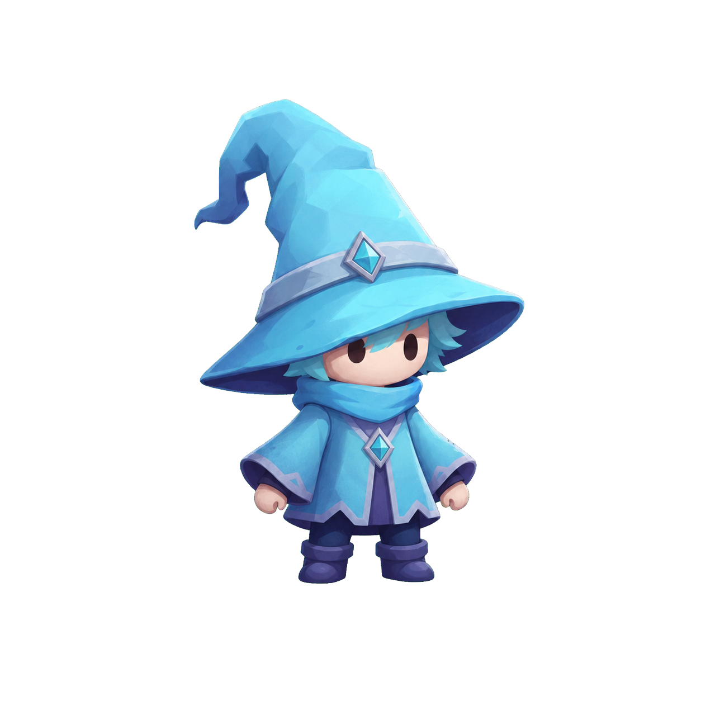
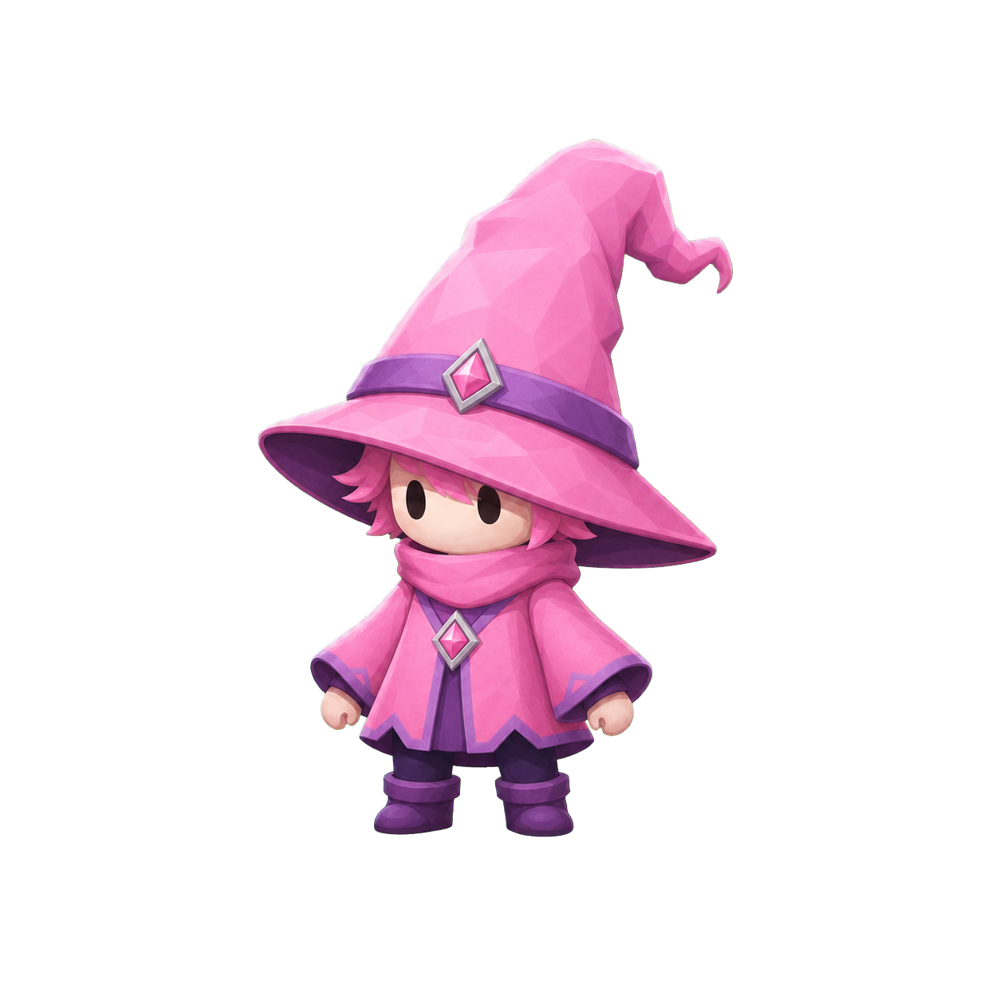
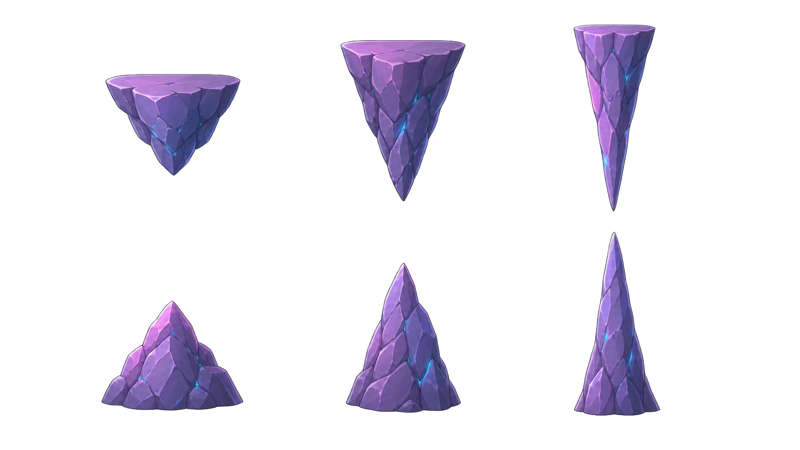

# Cozy Chaos — Product, Art, and Delivery Roadmap

Last updated: 2026-08-02 (Session 15). This is the shared handoff for BK,
Claude, and Codex.

> **Source of truth:** the active combat contract is
> `DESIGN-RUNE-BODY-COMBAT.md`. If this roadmap conflicts with that document,
> this roadmap is wrong.

## 1. Product intent

Cozy Chaos is a light, funny, addictive online physics duel inspired by Cat vs
Dog and Gunbound, but themed around magic. The player is allowed to draw a
name, a messy scribble, or an unfamiliar shape: every non-empty stroke becomes
literal physical matter.

The active product rules are:

- Both players draw secretly and cast simultaneously under identical rules.
- There are no assigned combat roles and no mode toggle.
- Ink buys mass. Fixed launch energy converts that mass into speed:
  - little Ink → light, fast, long reach → a strike;
  - much Ink → heavy, slow, short reach → a wall near the caster.
- Cast is a short direction-only drag. Drag length and pointer speed never buy
  power.
- Opposing rune matter destroys opposing matter symmetrically. The heavier
  body loses proportionally less, so defence emerges from physics rather than
  a separate shield resource.
- A spell consists of particles and bonds. Broken fragments stay physical and
  may remain dangerous while they retain energy.
- Wind and seeded, immutable crystals create Mini-Gunbound-style trajectory
  decisions. Collision is determined by authoritative geometry, never pixels.
- Fresh matter cannot hit its caster; matter deflected by a crystal, bond, or
  opposing rune can.

Punchline: **Draw Magic. Expect Chaos.** Mastery comes from Ink commitment,
aim, wind, collisions, fragments, and reflectors—not from reproducing four
approved symbols.

The previous assigned-role and reserved-Ink shield design was removed in
Session 12. It is historical context only and must not be reintroduced from an
old document.

## 2. Camera and art direction

The runtime remains a **side-view Canvas 2D simulation** presented as a layered
2.5D hand-painted diorama:

- floating dream island against a magical dream sky;
- layered/parallax background;
- faceted crystals, rim light, soft shadows, and three-quarter characters;
- procedural rune particles kept crisp above painted scenery.

This keeps arcs, wind, bounces, and spell-to-spell collisions readable. A true
3D/isometric runtime is outside the MVP contract: a screen-space stroke would
need an extra depth-plane interpretation, and hidden depth weakens the fairness
of Gunbound-like ballistics. See amendment A-07 in `PRD-AMENDMENTS.md`.

3D is still valid as an **asset pipeline**: build or generate a consistent 3D
character, then render it into 2D sprite sheets. Only PNG output enters the
runtime.

PixelLab is a possible pixel-art pipeline, not an automatic upgrade. The
current visual candidates are painterly; mixing one pixel-art character into a
painterly build is an art-style pivot that requires an explicit A/B decision.

## 3. Current implementation snapshot

Implemented vertical slice:

- TypeScript monorepo with shared config, protocol, and deterministic sim.
- Authoritative WebSocket room server, room codes, reconnect, and rematch.
- Fixed-timestep, seeded Resolve; both clients receive identical frames.
- `Setup → Draw → Cast → Reveal → Resolve → Score` flow.
- Arbitrary-stroke rune bodies made from particles and breakable bonds.
- Ink→mass→speed→reach combat with symmetric, mass-weighted destruction.
- Seeded Round wind and randomized immutable crystal reflectors.
- Circle/capsule-vs-triangle collision with swept anti-tunnelling.
- Responsive multiplayer browser UI; portrait 390×844 was verified without
  overflow in Session 11.

Verification on 2026-08-02: **189 tests passed**. Typecheck, build, and audit
must also pass before the Session 15 commit sequence is declared complete.

Relevant contracts:

- `DESIGN-RUNE-BODY-COMBAT.md`
- `PRD-AMENDMENTS.md`
- `PRD.md`
- `HANDOVER-CODEX.md`
- `ASSET-PROVENANCE.md`
- `changelog.md`

## 4. Generated ImageGen asset inventory

All generated files are intentionally retained for provenance. None is wired
to `matchScene.ts`; the programmatic renderer remains active.

### Obsolete-theme arena concept — 1672×941

This file belongs to the removed pre-Session-12 environment direction. It is
kept as history and must not be used as the active background.

File: `client/public/assets/generated/cozy-cave-arena.png`

### Cyan wizard candidate — 1254×1254, transparent

File: `client/public/assets/generated/wizard-cyan.png`

### Pink wizard candidate — 1254×1254, transparent

File: `client/public/assets/generated/wizard-pink.png`

### Obsolete-theme reflector sheet — 1672×941, transparent

This sheet also belongs to the removed environment direction and is retained
only for provenance.

File: `client/public/assets/generated/cave-reflectors-sheet.png`

The two wizard cutouts remain candidates, but their 48–80 px readability must
be tested before integration. Exact status, prompts, and processing are in
`ASSET-PROVENANCE.md`; machine-readable metadata is in
`client/public/assets/generated/manifest.json`.

## 5. PixelLab status and future pilot

PixelLab is **not connected** and no PixelLab generation has been run. A token
was pasted into chat, so it must be revoked/rotated before later use. It is not
stored in this repository, documentation, or source code.

When the art gate opens, the smallest useful PixelLab experiment is one cyan
wizard at 96×96 or 128×128 with a stable bottom-centre pivot:

1. six-frame neutral idle;
2. eight-frame role-neutral cast gesture;
3. only after those pass: hit and KO.

Acceptance is visual at 48 px and 80 px: no hat/face/robe/palette drift, no
pivot jitter, clean transparency, a seamless idle loop, consistent frame
bounds, and no projectile baked into character frames. If two controlled
attempts fail, stop prompt-chasing and prefer a 3D→2D sprite pipeline or the
painterly programmatic fallback.

Any future replacement token belongs in a local secret store (for example an
MCP authorization header), never in chat or git. PixelLab output, if approved,
goes into a new `client/public/assets/pixellab-pilot/` folder with a manifest.

## 6. Delivery roadmap

### Stage 1 — Repository recovery and source-truth sync

- Align roadmap, README, provenance, and manifest with the active combat code.
- Amend the obsolete Three.js requirement to layered Canvas 2D.
- Preserve and commit Sessions 8–15 in readable groups: shared sim/protocol,
  server, client, art candidates, then documentation.
- Gate: 189 tests, typecheck, build, audit 0, and a clean worktree.

### Stage 2 — Human combat validation

This is the next product blocker. Before producing more art:

- export per-Turn telemetry from authoritative server snapshots;
- run 10+ human playtests;
- measure whether players discover “little Ink = strike, much Ink = wall”;
- measure intentional heavy-rune interception, deflection readability, Turns
  per KO, match duration, and “my drawing was not read” complaints;
- define a pass threshold and a design response for every metric.

The full execution contract is T6–T7 in `HANDOVER-CODEX.md`.

### Stage 3 — Art pipeline decision (blocked by Stage 2)

BK chooses one direction after combat validation:

1. preferred consistency route: 3D source → rendered 2D sprite sheets;
2. controlled PixelLab pixel-art A/B pilot; or
3. retain painterly static/programmatic characters.

Do not build multiple complete asset pipelines before comparing a tiny pilot at
real mobile render size. Runtime asset loading must retain the programmatic
renderer as fallback and must never affect authoritative collision geometry.

### Deferred beyond the MVP

- true 3D/isometric runtime physics;
- eight-direction character rotations;
- fixed spell sprites that replace literal player-drawn matter;
- cosmetic production batches before combat passes human validation.

## 7. Decision ownership

Claude remains main lead. `HANDOVER-CODEX.md` determines the immediate task
order; this roadmap records product direction. BK owns the Stage 3 art-style
decision. Claude or Codex may implement the chosen work, but neither should
silently change combat physics while performing an art task.
